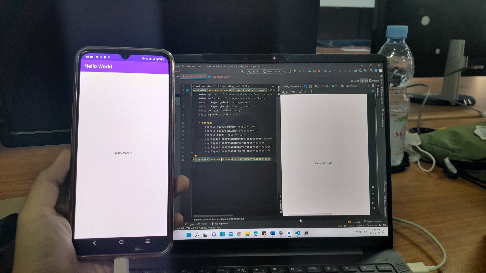

# TUGAS 1 PEMROGRAMAN MOBILE
### Nama  : Ana Qonitah Munawwaroh
###  Kelas : TI - 3C
### Absen : 04

  TUGAS 1  
Membuat project hello world di Android Studio, lalu push ke repository GitHub Anda dg nama hello-world-android. Kumpulkan link repo tsb ke LMS!
  
#### JAWABAN SCREENSHOT HASIL PRAKTIKUM
  

